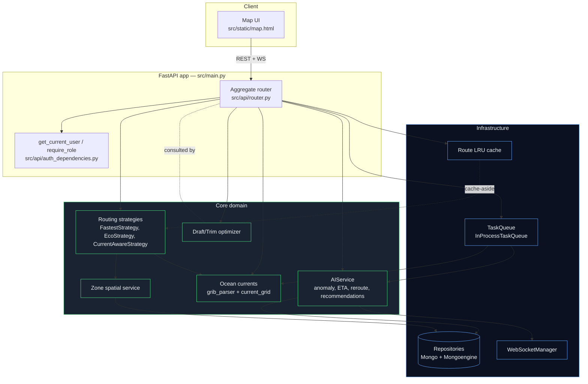
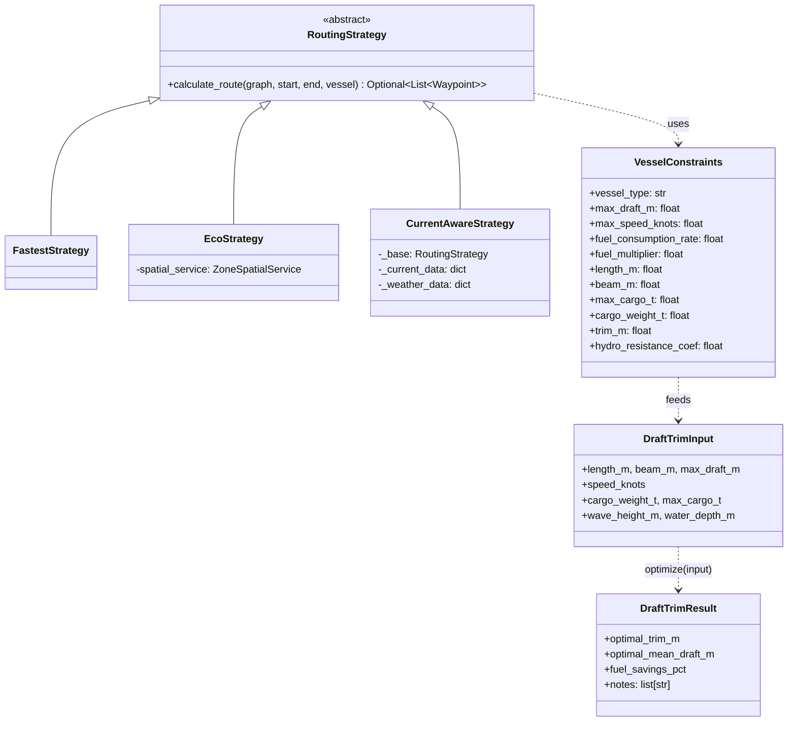
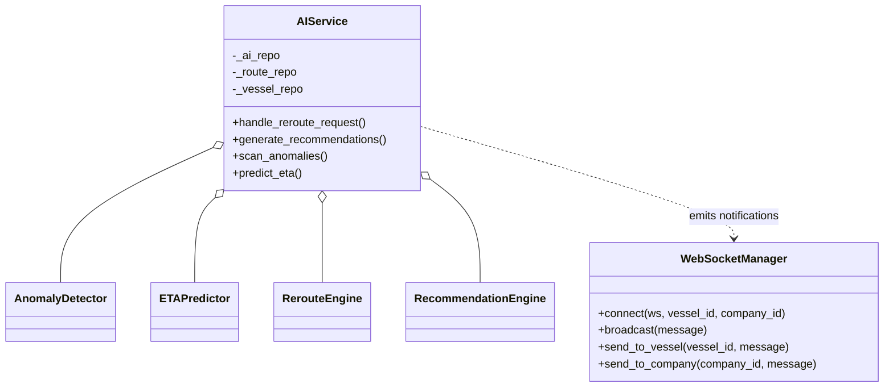
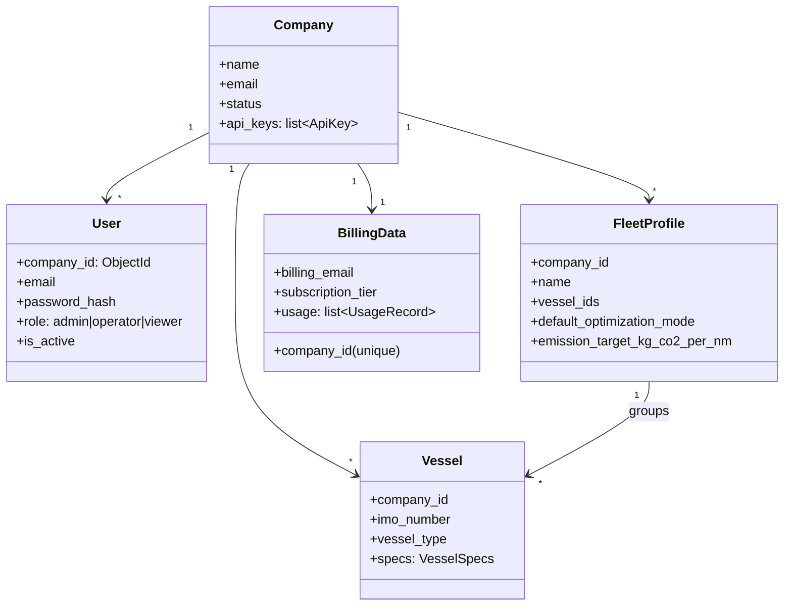
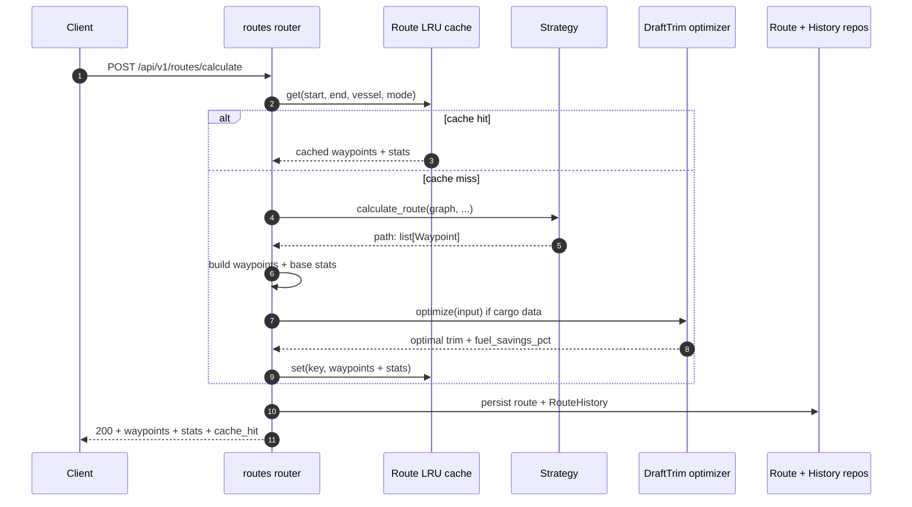
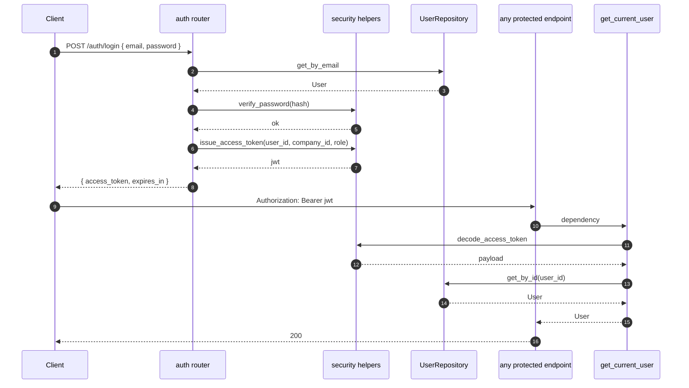
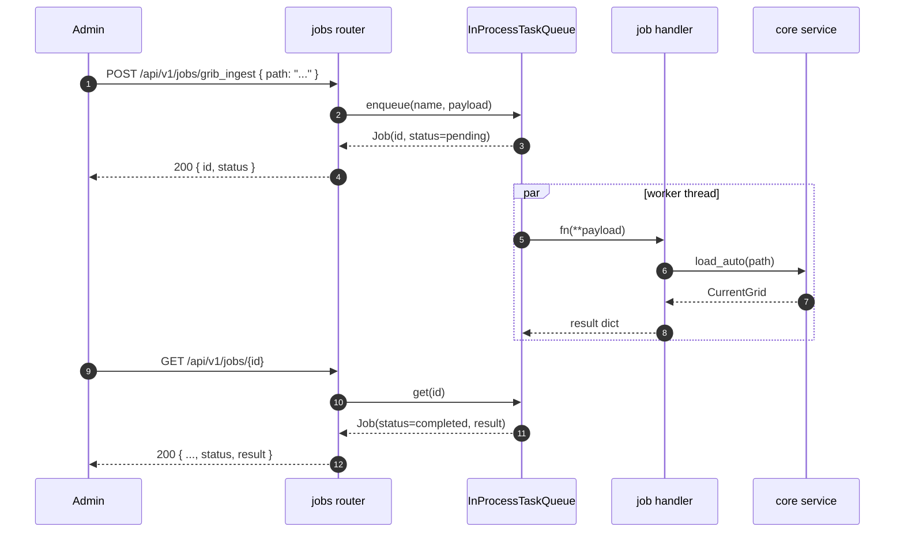
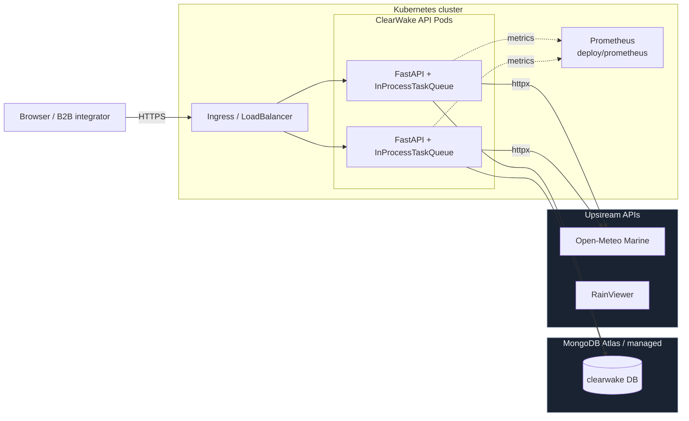

# ClearWake Architecture

This document describes how the ClearWake Routing platform is wired together: the major modules, how a request travels through the stack, and how the pieces are deployed. All diagrams are Mermaid so they render directly in GitHub.

## Module map

## Class diagram — routing layer

## Class diagram — AI subsystem

## Class diagram — auth + tenancy

## Sequence — `/routes/calculate` happy path

## Sequence — JWT login + protected call

## Sequence — background job

## Deployment

Each API pod runs its own `InProcessTaskQueue` — jobs that need cross-pod coordination should move to RQ + Redis (the `TaskQueue` interface is the swap-point).

## API surface (high level)

| Group              | Path prefix                | Notes |
|--------------------|---------------------------|-------|
| Auth (JWT)         | `/api/v1/auth`             | login, register (admin), bootstrap-admin, me |
| Routes             | `/api/v1/routes`           | calculate (LRU-cached), batch, history, landmask |
| Routing meta       | `/api/v1/routing`          | strategy info |
| Vessels            | `/api/v1/vessels`          | CRUD, subtype factory |
| Fleet              | `/api/v1/fleet`            | legacy fleet ops |
| Fleet profiles     | `/api/v1/fleet-profiles`   | tenant-scoped, issue #86 |
| Companies          | `/api/v1/companies`        | tenant management |
| Billing data       | `/api/v1/billing-data`     | one per company, issue #86 |
| Zones              | `/api/v1/zones`            | spatial zones |
| AI                 | `/api/v1/ai`               | reroute, recommendations, anomalies, ETA |
| AI notifications   | `/ws/ai/notifications`     | WebSocket |
| Weather            | `/api/v1/weather`          | marine, route weather, currents |
| Analytics          | `/api/v1/analytics`        | aggregates |
| Port scheduling    | `/api/v1/port-scheduling`  |  |
| Optimization       | `/api/v1/optimization`     | draft/trim helper |
| Jobs (admin)       | `/api/v1/jobs`             | issue #85 |

Full OpenAPI is available at `/docs` (Swagger UI) and `/openapi.json` once the app is running.
